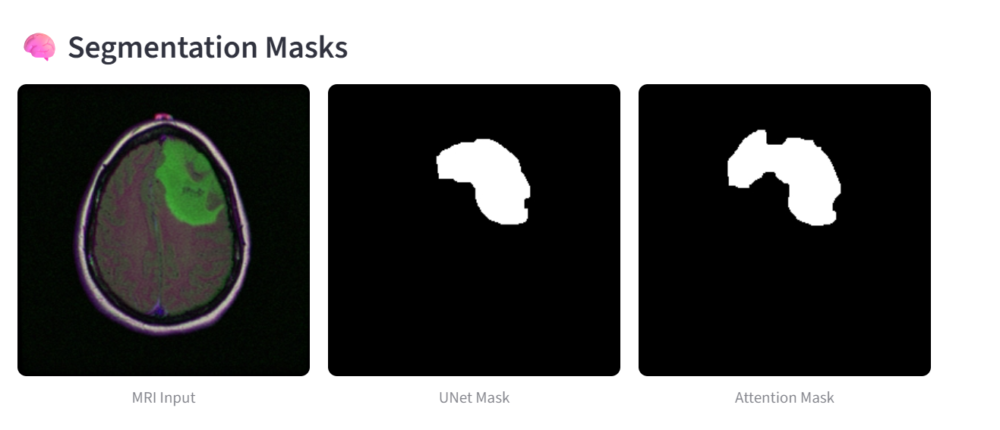
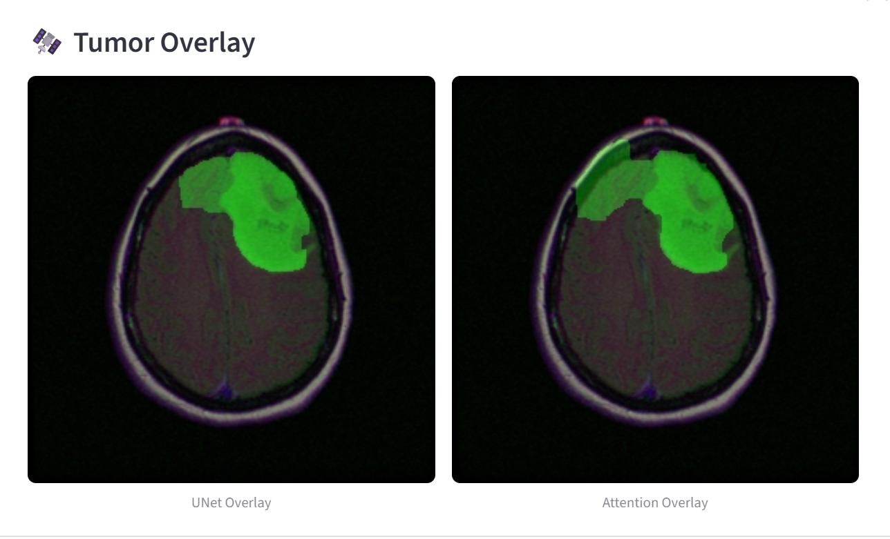
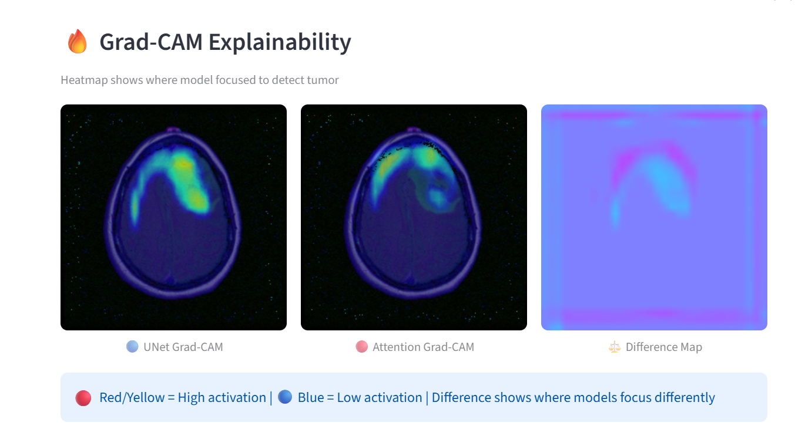

# 🧠 Brain Tumor Segmentation — UNet vs Attention UNet


A deep learning project for **automatic brain tumor segmentation** from MRI images using custom UNet and Attention UNet architectures with **Grad-CAM explainability**.

---

## 📸 Demo

### 🧠 Segmentation Masks


### 🟢 Tumor Overlay


### 🔥 Grad-CAM Explainability


---

## 🎯 Results

| Metric | U-Net | Attention U-Net | Winner |
|--------|-------|-----------------|--------|
| **IoU** | 0.7469 | 0.7354 | U-Net |
| **Dice** | 0.8306 | 0.8235 | U-Net |
| **Precision** | 0.8580 | 0.8087 | U-Net |
| **Recall** | 0.8601 | **0.8915** | Attention |

> **Key Finding:** U-Net achieves better overall segmentation accuracy while Attention U-Net detects more complete tumor regions with superior Recall of 0.8915 — making it preferred for clinical applications where missing tumor tissue is critical.

---

## ✨ Features

- ✅ **Two Model Comparison** — UNet vs Attention UNet side by side
- ✅ **Real-time Segmentation** — Upload MRI and get instant results
- ✅ **Tumor Coverage %** — Quantitative tumor area measurement
- ✅ **Grad-CAM Explainability** — Visual explanation of model decisions
- ✅ **Difference Map** — Shows where models focus differently
- ✅ **Noise Removal** — Morphological post-processing
- ✅ **Download Results** — Save segmentation output
- ✅ **Model Metrics** — Results table in sidebar

---

## 🏗️ Project Structure
brain-tumor-segmentation/
├── app.py              # Streamlit web application
├── predict.py          # Model inference pipeline
├── model.py            # UNet and Attention UNet architectures
├── gradcam.py          # Grad-CAM explainability
├── requirements.txt    # Dependencies
└── assets/             # Screenshots
├── segmentation_masks.png
├── tumor_overlay.png
└── gradcam.png

---

## 🧠 Model Architectures

### U-Net
Input (3×256×256)
↓
Encoder: 64 → 128 → 256 channels
↓
Bottleneck: 512 channels
↓
Decoder: 256 → 128 → 64 channels
↓
Output (1×256×256) — Binary tumor mask

### Attention U-Net
Same as U-Net BUT with Attention Gates:

Gate 1: F_g=256, F_l=256, F_int=128
Gate 2: F_g=128, F_l=128, F_int=64
Gate 3: F_g=64,  F_l=64,  F_int=32

Attention gates filter irrelevant brain regions
and focus only on tumor areas → Higher Recall

---

## 🔥 Grad-CAM Explainability

Grad-CAM visualizes which brain regions each model focuses on:

| Color | Meaning |
|-------|---------|
| 🔴 Red/Yellow | High activation — model focused here |
| 🔵 Blue | Low activation — model ignored here |
| 🟣 Difference Map | Where models focus differently |

---

## 📊 Dataset

| Property | Value |
|----------|-------|
| **Name** | Brain MRI Segmentation (LGG) |
| **Source** | Kaggle / TCGA Cancer Imaging Archive |
| **Total Images** | 3,929 MRI scans |
| **Total Patients** | 110 |
| **Tumor Slices** | 1,373 (used for training) |
| **Train Split** | 1,098 images (80%) |
| **Val Split** | 275 images (20%) |
| **Image Size** | 256 × 256 pixels |
| **Mask Type** | Binary (tumor / non-tumor) |

---

## 🚀 How To Run

### 1. Clone repository
```bash
git clone https://github.com/Saniyakhannn/brain-tumor-segmentation.git
cd brain-tumor-segmentation
```

### 2. Install dependencies
```bash
pip install -r requirements.txt
```

### 3. Add model weights
Download and place in project folder:
best_unet.pth
best_attention.pth

### 4. Run Streamlit app
```bash
streamlit run app.py
```

### 5. Upload MRI image
Supported formats: JPG, PNG, TIF, TIFF
Recommended: Brain MRI from LGG dataset

---

## 📈 Training Details

| Parameter | Value |
|-----------|-------|
| **Optimizer** | Adam |
| **Learning Rate** | 1e-4 |
| **Loss Function** | BCE + Dice (0.3/0.7) |
| **Epochs** | 30 |
| **Batch Size** | 8 |
| **Scheduler** | ReduceLROnPlateau |
| **Early Stopping** | Patience = 5 |
| **Augmentation** | Flip, Rotation, Brightness, Contrast |

---

## 🛠️ Tech Stack

| Tool | Purpose |
|------|---------|
| **PyTorch** | Model training and inference |
| **Streamlit** | Web application |
| **OpenCV** | Image processing |
| **Grad-CAM** | Model explainability |
| **Matplotlib** | Visualization |
| **NumPy** | Array operations |

---

## 🔬 Key Findings
1. UNet achieves higher Precision (0.8580) → Fewer false positives → Better for reducing unnecessary biopsies
2. Attention UNet achieves higher Recall (0.8915) → Detects more complete tumor regions → Better for clinical use (missing tumor = dangerous)
3. Grad-CAM confirms both models correctly focus on tumor regions — not random areas
4. Attention gates improve tumor coverage especially for large irregular tumors

---

## 🌊 Related Project

Check out my **Flood Area Segmentation** project:
👉 [flood-area-segmentation](https://github.com/Saniyakhannn/flood-area-segmentation)

Same architecture applied to drone imagery for disaster management!

---

## 👩‍💻 Author

**Saniyakhannn**
- 🐙 GitHub: [@Saniyakhannn](https://github.com/Saniyakhannn)
- 🌊 Flood Project: [flood-area-segmentation](https://github.com/Saniyakhannn/flood-area-segmentation)
- 🧠 Brain Tumor: [brain-tumor-segmentation](https://github.com/Saniyakhannn/brain-tumor-segmentation)

---

## 📄 License

This project is licensed under the MIT License — see [LICENSE](LICENSE) for details.

---

⭐ **If you find this project useful please give it a star!** ⭐
